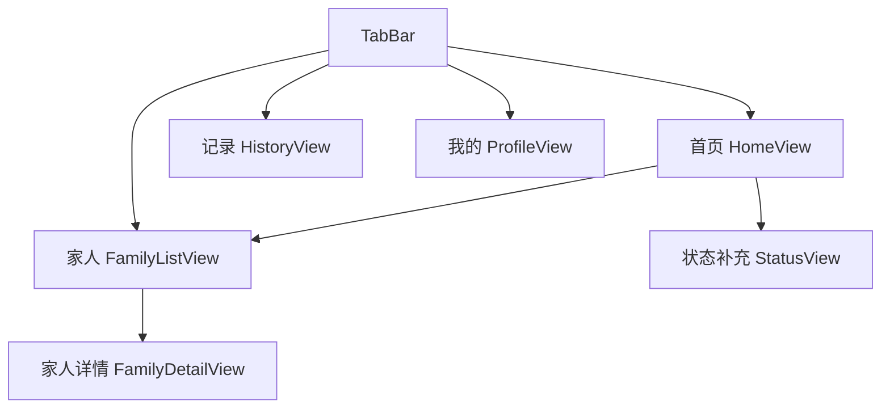

# FamilyConnect 父母端 MVP 原型图全览

> 说明：以下是基于 PRD 的信息架构与关键页面低保真总览，可直接用于 Figma 复刻。

## 1. 信息架构（IA）



## 2. 页面线框总览

```text
┌──────────────────────────────────────────────┐
│ 首页 HomeView                               │
│ [GreetingCard] 早上好，王叔叔 / 今日状态      │
│ [MoodCard]   良好 / 一般 / 不佳               │
│ [Activity]   吃药 / 散步 / 阅读（单击即记录）   │
│ [FamilyFeedback] 女儿已查看，儿子留言           │
│ [QuickActions] 联系家人 | 补充情况             │
└──────────────────────────────────────────────┘

┌──────────────────────────────────────────────┐
│ 状态补充 StatusView                          │
│ 当前状态：良好                               │
│ 标签：有点头晕 / 没睡好 / 胃不舒服 / 有点累      │
│ [完成]（保存 note 并返回）                    │
└──────────────────────────────────────────────┘

┌──────────────────────────────────────────────┐
│ 历史记录 HistoryView                         │
│ 最近7天：记录X天 🌱                           │
│ 列表：日期 + 状态 + 吃药/散步/阅读             │
└──────────────────────────────────────────────┘

┌──────────────────────────────────────────────┐
│ 家人列表 FamilyListView                      │
│ 女儿  今天已查看                              │
│ 儿子  未查看                                  │
└──────────────────────────────────────────────┘

┌──────────────────────────────────────────────┐
│ 家人详情 FamilyDetailView                    │
│ 姓名 / 状态 / 最近留言                         │
│ [打电话] [发一句话] -> ActionSheet快捷消息      │
└──────────────────────────────────────────────┘

┌──────────────────────────────────────────────┐
│ 我的 ProfileView                             │
│ 姓名                                           │
│ 字体：标准 / 大 / 超大                         │
│ 提醒时间：默认09:00                            │
│ 通知：开关                                     │
│ 帮助：联系客服 / 关于应用                       │
└──────────────────────────────────────────────┘
```

## 3. 关键交互

- 心情与行为记录均为**单击完成**，立即反馈“已记录”。
- 补充情况无需二次确认，点击完成即保存并返回首页。
- 提醒规则：09:00 首次提醒，20:00 二次提醒（最多 2 次）。
